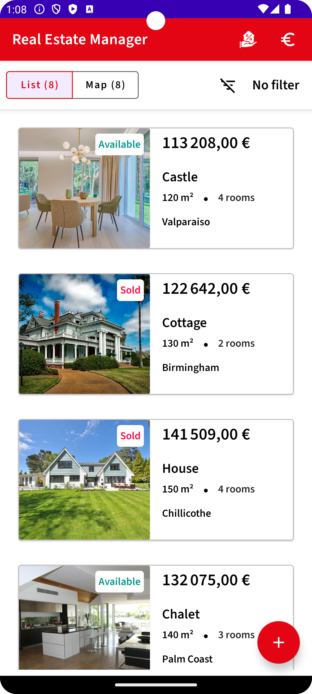
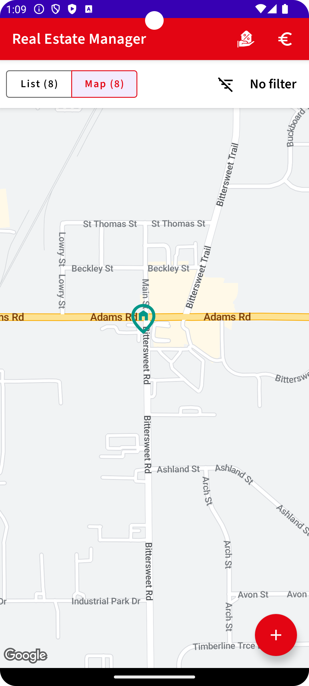
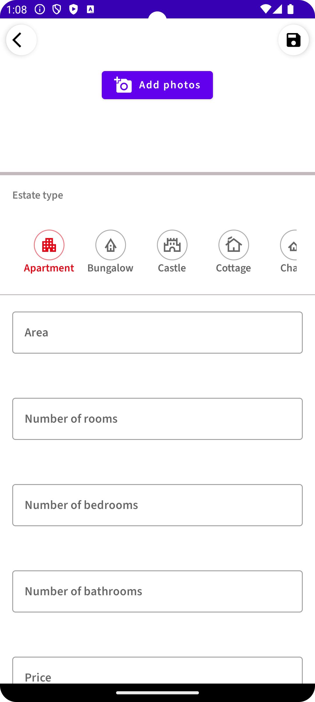
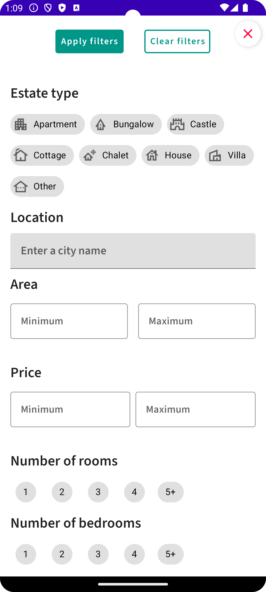
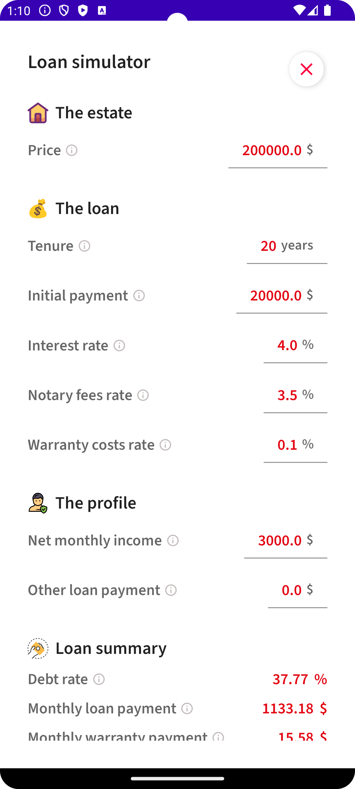
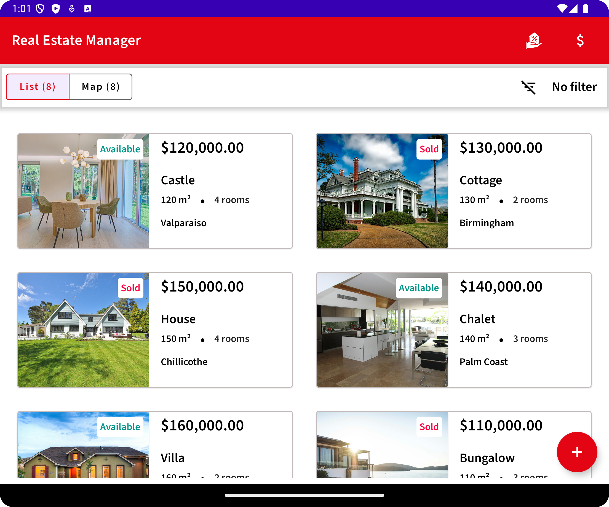
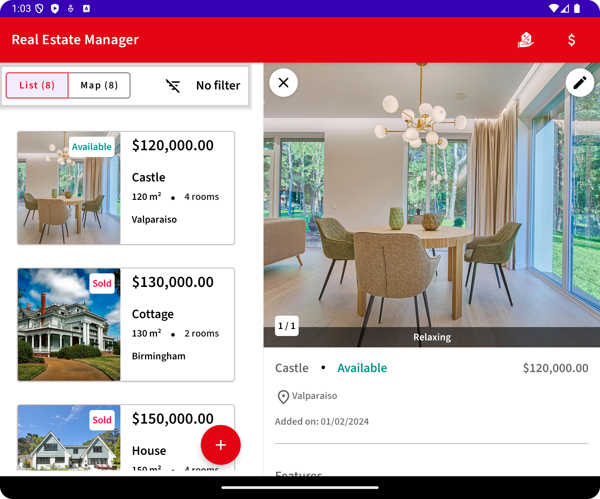
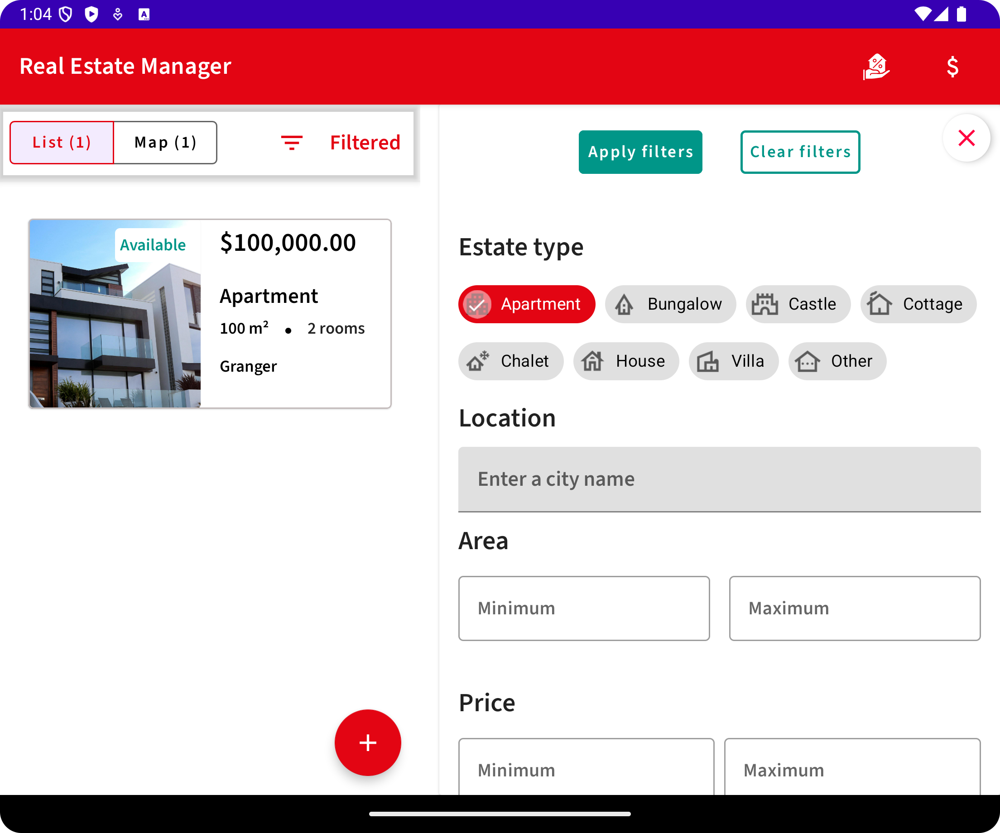

# Real Estate Manager

## Overview

This app is a real estate management tool that allows agents to easily list, manage, and search
properties. Users can view property details, including photos and locations on a map. Key
features include a loan simulator for mortgage calculations, real-time notifications for property
updates, and a Content Provider for data exposure. The app also supports multi-criteria filtering
and currency conversion between Euro and Dollar.

## Getting Started

To enable location-based services, the app requires API key to access Google Maps API.

1. Obtain an API key from the Google Cloud Console.
2. Open the secrets.properties file in your top-level directory, and then add the following code:
   MAPS_API_KEY = YOUR_API_KEY
3. Create the local.defaults.properties file in your top-level directory, the same folder as the
   secrets.properties file, and then add the
   following code:
   MAPS_API_KEY=DEFAULT_API_KEY
4. Build and run the app

## Features

**Property Listing:**  View a list of available properties with essential details.
**Property Details:** Access full property information, including photos, descriptions, and nearby
locations on a map.
**Property Management:** Add, edit, or mark properties as sold with ease.
**Search & Filter:** Perform multi-criteria searches by property type, price, location, and more.
**Map Integration:** Display properties on a dynamic map with geolocation details.
**Notifications:** Receive notifications when new properties are added or updates are made.
**Content Provider:** Expose property data through a Content Provider for external access.
**Currency Conversion:** Seamlessly convert property prices between Euro and Dollar.
**Loan Simulator:** Calculate mortgage options with customizable inputs for loan amount, interest
rate, and duration.

## Screenshots

 
  
  
  
  
  
  
  
  
  

## Tech Stack

- **Jetpack Compose**: Used for building the user interface in a declarative way.
- **[Voyager](https://voyager.adriel.cafe/)**: Handles in-app navigation with ease.
- **[Google ML Kit](https://developers.google.com/ml-kit)**: Provides machine learning capabilities.
    - [Image Labeling](https://developers.google.com/ml-kit/vision/image-labeling)
    - [Barcode Scanning](https://developers.google.com/ml-kit/vision/barcode-scanning)
    - [Text Recognition](https://developers.google.com/ml-kit/vision/text-recognition)
